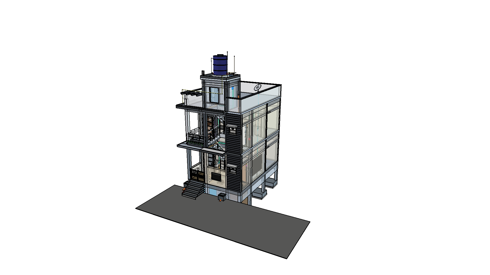

# Modern Residential Single-Family Home (Ground Floor + G+1 Expansion)

> **Autonomous AI-Driven Parametric Architectural Engineering**  
> Built entirely using **FreeCAD 1.1.3**, a **Robust MCP (Model Context Protocol) Bridge**, and **Google Gemini**, where the complete multi-storey architectural, structural, electrical (MEP), and plumbing infrastructure was **constructed 100% through conversational Natural Language prompting**.

---

## 🏛️ 3D Architectural Overview



*Full Multi-Storey 3D Isometric View: Substructure Footings, Plinth-Integrated Tanks, Ground Floor, First Floor Balcony, Contemporary Charcoal Facade, 4-Winder Circulation Core, Mumty Tower, and 1000L Overhead Water Tank (OHT).*

---

## 🌟 Project Highlights

- **Natural Language Construction:** Every single element—from substructure isolated footings to rooftop telecom cowls—was designed, modeled, parameterized, positioned, and debugged purely via natural language dialogue with **Google Gemini**.
- **Model Health & Fidelity:** **612 parametric solid objects**, 86 functional assembly groups, **0 recompute errors**, **0 non-manifold warnings**, and **100% collision-free geometry**.
- **Dual-Phased Architecture:**
  - **Ground Floor (Phase 1):** Fully detailed active residence with Sitout, Living Room, Master Bedroom, Kitchen with Breakfast Counter, Toilet with sunken shower, Under-stair Laundry/Pump station, and Entrance Steps.
  - **First Floor (Phase 2):** Complete 1:1 modular expansion ready for vertical construction, featuring a cantilevered Balcony (*Palkani*), independent Electricity Board (EB) distribution, and symmetrical room layouts.
  - **Rooftop & Terrace:** Staircase Headroom (*Mumty*) tower, 1000L OHT on raised masonry saddle, DTH satellite dish antenna, and perimeter stainless steel safety balustrades.

---

## 🛠️ Technology Stack & AI-to-CAD Workflow

```
┌────────────────────────┐      Natural Language       ┌────────────────────────┐
│     USER / ARCHITECT   │  ◄────────────────────────► │     GOOGLE GEMINI      │
│  (Design Directives)   │       Chat Interface        │   (LLM Reasoning Core) │
└────────────────────────┘                             └───────────┬────────────┘
                                                                   │
                                                      MCP Tool Calls / JSON-RPC
                                                                   │
                                                       ┌───────────▼────────────┐
                                                       │   ROBUST MCP BRIDGE    │
                                                       │  (XML-RPC / Coin3D)    │
                                                       └───────────┬────────────┘
                                                                   │
                                                       Parametric Python API
                                                                   │
                                                       ┌───────────▼────────────┐
                                                       │     FREECAD 1.1.3      │
                                                       │  Parametric BIM Engine │
                                                       │ (612 Manifold Solids)  │
                                                       └────────────────────────┘
```

1. **Google Gemini:** Analyzed hand-drawn reference sketches, architectural floor plans, and elevation photos; translated user design intent into parametric geometric definitions and engineering calculations.
2. **Robust MCP Bridge:** Facilitated real-time bidirectional communication between the LLM and the running FreeCAD GUI session via XML-RPC, allowing seamless script execution, viewport inspection, recomputation checks, and rendering captures.
3. **FreeCAD 1.1.3 Parametric Engine:** Computed solids, performed boolean cuts/unions, generated 2D TechDraw architectural sheets, and maintained the hierarchical document tree.

---

## 📐 Key Architectural & Structural Specifications

| Discipline | Specification | Details / Standards Compliance |
| :--- | :--- | :--- |
| **Plot Footprint** | $5.03\text{ m} \times 7.62\text{ m}$ ($16'\text{-}6" \times 25'\text{-}0"$) | Compact, climate-responsive South Indian urban residential footprint |
| **Floor Heights** | Ground Floor: $3.173\text{ m}$ ($10'\text{-}5"$) | Road ($Z=0$) $\to$ Plinth ($Z=914.4\text{ mm}$) $\to$ Roof Slab ($Z=4087.4\text{ mm}$) $\to$ FF Roof ($Z=7260.4\text{ mm}$) |
| **Structural Frame** | 14 RCC Column Grid ($228.6 \times 228.6\text{ mm}$) | M25 concrete frame designed for two-storey vertical and seismic load transfer |
| **Earthquake Bands** | 360° Closed-Loop Continuous Lintel & Sill Beams | Continuous RCC seismic ring beams compliant with **IS 4326** & **IS 456** |
| **Foundations** | 8 Isolated Footings & Column Pedestals | 100mm PCC blinding + 400mm RCC footings with zero-collision tank recesses |
| **Staircase Core** | 4-Winder Turnaround Landing + 17 Uniform Risers | **NBC 2016 Compliant:** $R = 186.65\text{ mm}$ ($\Delta R = 0.0\text{ mm}$), $249.25\text{ mm}$ tread going, $39.78^\circ$ pitch |
| **Safety Railings** | Marine-Grade Stainless Steel (SS 304) | Full outer handrails, mid-landing rails, inner stairwell rails, and void guardrails |
| **Toilet Sunken Floor**| 15 cm ($150\text{ mm}$) Sunken Wet Shower Area | Dry-wet segregation with black granite step riser and splash threshold curb |
| **Air Conditioning** | 1.5 Ton Inverter Split AC (GF & FF) | Indoor units on East wall, dedicated 20A DP boards, outdoor units (ODU) on East wall cantilever brackets |
| **Water Storage** | Dual-Tank Potable & Domestic System | 3,888L Plinth-level Underground Sump + 1,000L Rooftop Overhead Tank (OHT) |
| **Drainage System** | Dual-Stream Segregated Gravity Outfall | **IS 1742 & IS 2470 Compliant:** Kitchen greywater (GT-1 / IC-1), toilet sullage (GT-2 / IC-2), and blackwater soil stack to 2,592L Septic Tank |
| **Electrical / MEP** | 100% Concealed Orthogonal Grid | Ceiling slab conduits, chased wall drops, deep PVC pot boxes, 1.1kVA UPS backup, and 6-channel CCTV |

---

## 🗂️ FreeCAD Document Tree Hierarchy

The 612 model objects in [`HomeConstruction.FCStd`](HomeConstruction.FCStd) are structured into **5 Master Assembly Containers** and **1 TechDraw Page**:

```
HomeConstruction.FCStd (Master Document: 612 Objects, 0 Errors)
├── 1. Substructure_Foundation_Group (Substructure & Foundation: Ground to -1.6m)
│   ├── PCC_Blinding_Layer_Group (8 Footing Blinding Pads - 100mm M7.5)
│   ├── Isolated_Footings_Group (8 RCC Isolated Footings - 400mm M25)
│   ├── Column_Pedestals_Group (14 RCC Column Pedestals / Substructure Stubs)
│   ├── GF_Plinth_Beams (10 RCC Plinth Beams - PB1 & PB2 Network)
│   └── Plinth-Level Utility Tanks (3888L Sump & 2592L Septic Tank + SS Airtight Covers)
│
├── 2. Ground Floor (Complete) [Ground_Floor_Group]
│   ├── Structural Frame (14 RCC Columns, Roof Beams RB1/RB2, Lintel & Sill Belts)
│   ├── Rooms & Interiors (Sitout, Living Room, Bedroom with AC, Kitchen with Breakfast Bar, Toilet with Sunken Floor)
│   ├── Staircase & Utilities (Flight 1 & 2, 4-Winder Landing, Under-Stair Washing Machine & Sump Pump)
│   ├── Elevation Architecture (Sitout SS Safety Gate, Teak Double Door, Louver Niche Wall, Entrance Portico Canopy)
│   └── Electrical & CCTV (Orthogonal Slab Conduits, Wall Drops, 16 Modular Switchboards, 6 HD Cameras)
│
├── 3. First Floor (Complete) [First_Floor_Group]
│   ├── Structural Frame (14 Columns, Upper Ring Beams, Balcony Canopy & Rain Chajjas)
│   ├── Symmetrical Floor Plan (Balcony, Living Room, Bedroom with AC, Kitchen, Toilet)
│   ├── Vertical Circulation (Flight 2 Stairs to Terrace with SS 304 Balustrades & Void Return Barrier)
│   └── MEP & Power (Independent First Floor EB Mains Riser & Modular Distribution Board)
│
├── 4. Rooftop & Terrace (Complete) [Master_Rooftop_Terrace_Group]
│   ├── Staircase Headroom (Mumty) Tower (RCC Columns, Lintel Band, Access Door & Roof Slab)
│   ├── Rooftop Terrace Slab & Parapet Wall (1.0m High with Coping & Cantilever Pergola Trellis)
│   └── Telecommunications & DTH (650mm Dish TV Antenna & Weatherproof Service Entry Cowl)
│
├── 5. Master Plumbing Network [Master_Plumbing_Network_Group]
│   ├── 01 Municipal Water Supply to Sump Network (Connection, Ball Valve, Flow Meter, Float Valve)
│   ├── 02 Overhead Water Tank Assembly (1000L Sintex Tank, Ball Float, Overflow, Scour Drain)
│   ├── 03 Sump Pump Rising Main & Vertical False Duct (1.0 HP Motor Discharge Riser)
│   ├── 04 Gravity Down-take Distribution Network (Lines A, B, C, D: Toilet, Kitchen, Laundry, Terrace)
│   ├── 05 Zonal Isolation Shut-Off Valves (Quarter-Turn Quick-Shutoff Levers for All Zones)
│   └── 06 Building Drainage Network (Kitchen Sullage GT-1 & IC-1, Toilet Sullage GT-2 & IC-2, WC Soil Stack)
│
└── 6. Page_Ground_Floor_Plan (TechDraw 2D Dimensioned Architectural Plan Sheet - A3)
```

---

## 📁 Repository & Workspace Organization

```
c:\Users\prade\OneDrive\Desktop\home plan\
├── HomeConstruction.FCStd          # Master FreeCAD 3D parametric BIM model (612 objects)
├── walkthrough.md                  # Master Architectural Documentation & 72 Construction Schedules
├── CONSTRUCTION_COPILOT_SPEC.md    # Construction AI Copilot & Knowledge Base (KB) Master Architecture
├── README.md                       # Project overview, methodology & quick start guide
│
├── renders/                        # High-resolution 3D renders & orthographic projections
│   ├── all_objects_visible_isometric.png   # Full 3D isometric overview render
│   ├── all_objects_visible_front.png       # Front facade elevation render
│   ├── winder_stairs_steps_detail.png      # 4-Winder staircase turnaround detail
│   └── all_staircase_railings_complete.png # Full SS 304 safety railings visualization
│
├── references/                     # Original design inputs, site surveys & inspiration photos
│   ├── IMG_0371.JPEG               # Ground floor initial concept sketch
│   ├── IMG_0373.PNG                # Staircase winder turning detail sketch
│   └── IMG_0379.JPG                # Contemporary front facade reference photo
│
└── backups/                        # Timestamped incremental backups and historical versions
```

---

## 🚀 How to Open and Explore

1. **Prerequisites:** Install [FreeCAD 1.1.0 or newer](https://www.freecad.org/) (Recommended: FreeCAD 1.1.3).
2. **Open Master Model:** Launch FreeCAD and open [`HomeConstruction.FCStd`](HomeConstruction.FCStd).
3. **Navigate 3D Model:**
   - Press `0` or select **Isometric View** to inspect the overall building volume.
   - Use the **Spacebar** in the Tree View on any master group or sub-group (e.g., `Ground_Floor_Group` or `Master_Plumbing_Network_Group`) to isolate and inspect specific disciplines.
   - Switch to the **TechDraw Workbench** and double-click `Page_Ground_Floor_Plan` to view the fully dimensioned 2D architectural blueprint.
4. **Consult Specifications:** Refer to [`walkthrough.md`](walkthrough.md) for complete bill-of-quantities (BOQ), conduit coordinate logs, sanitary pipe slope schedules, and structural rebar details.
5. **AI Construction Copilot & Knowledge Base:** Refer to [`CONSTRUCTION_COPILOT_SPEC.md`](CONSTRUCTION_COPILOT_SPEC.md) for the complete architecture of the mobile-accessible, 24/7 AI site agent, work velocity tracking, and cost prediction engine.

---

*Engineered with precision using Gemini AI & FreeCAD Parametric Architecture.*
