## 13. FreeCAD Document Hierarchy & Tree Structure

The document tree in [`HomeConstruction.FCStd`](file:///c:/Users/prade/OneDrive/Desktop/home%20plan/HomeConstruction.FCStd) is strictly organized into **3 pristine top-level master groups** (420 objects total, 0 cyclic dependencies):

```mermaid
graph TD
    Doc["HomeConstruction.FCStd (Master Model: 612 Objects, 0 Errors)"]
    Doc --> SUB["1. Substructure & Foundation [Substructure_Foundation_Group]"]
    Doc --> GF["2. Ground Floor (Complete) [Ground_Floor_Group]"]
    Doc --> FF["3. First Floor (Complete) [First_Floor_Group]"]
    Doc --> RT["4. Rooftop & Terrace [Master_Rooftop_Terrace_Group]"]
    Doc --> PLUMB["5. Master Plumbing Network [Master_Plumbing_Network_Group]"]
    Doc --> TD["6. 2D Architectural Plan Sheet [Page_Ground_Floor_Plan]"]

    subgraph SUB_Containers ["Substructure & Foundation Hierarchy (4 Sub-Groups + 6 Objects)"]
        SUB --> SUB_PCC["PCC Footing Blinding Beds (100mm M7.5 - 8 Pads)"]
        SUB --> SUB_Footings["RCC Isolated Footings (400mm M25 - 8 Footings)"]
        SUB --> SUB_Peds["RCC Column Pedestals (Substructure Stubs - 14 Pedestals)"]
        SUB --> SUB_PlinthBeams["GF Plinth Beams (PB1 & PB2 Network - 10 Beams)"]
        SUB --> SUB_Tanks["Plinth-Integrated Tanks: Sump (3888L) & Septic (2592L) + SS Manhole Covers"]
    end

    subgraph GF_Containers ["Ground Floor Hierarchy (15 Sub-Groups)"]
        GF --> GF_Site["GF Site & Substructure (Road, Sump, Septic, Steps, East Wall)"]
        GF --> GF_Cols["GF Structure & Columns (14 RCC Columns, Floor Slabs, RB1/RB2, Lintel & Sill Beams)"]
        GF --> GF_Gate["GF Sitout Entrance Gate (Posts, Hinges, SS/Charcoal Leaves, Aldrop)"]
        GF --> GF_Elev["GF Front Elevation Design Features (Door Surround, Louvers, Fascia)"]
        GF --> GF_Canopy["GF Entrance Canopy Group (Soffit, Recessed LEDs, Fascia)"]
        GF --> GF_StairCanopy["GF Stair Rain Protection Group (Canopy Slab, Louver Wall)"]
        GF --> GF_Living["GF Living Room (Walls, Teak Double Door, East 3-Split Window, West TV Unit & Wi-Fi Station)"]
        GF --> GF_Bed["GF Bedroom (Walls, Bed, Wardrobe, North Loft, Split AC Indoor Unit)"]
        GF --> GF_Kit["GF Kitchen (Walls, Counters, Breakfast Bar, Dual-Tap Sink, Hob, Lofts)"]
        GF --> GF_Toilet["GF Toilet (Walls, Dropped Ceiling, Sunken Wet Area -15cm, Ventilator, WC, Shower)"]
        GF --> GF_Stair["GF Staircase & Utilities (4-Winder Landing, 17 Risers, Sump Motor, Washer, SS Railings)"]
        GF --> GF_ElecConduit["Electrical Slab Conduit & Ceiling Lighting Group (Fan Boxes, Pot Lights, Conduits)"]
        GF --> GF_Switchboards["Electrical Switchboards Group (Modular Switchboards + MDB + AC SB)"]
        GF --> GF_CCTV["Electrical CCTV Network Group (6 Cameras, J-Boxes, Conduits, NVR Hub, 1.1kVA UPS Backup)"]
        GF --> GF_AC_ODU["GF Bedroom AC Split AC Outdoor Unit (ODU, Cantilever Brackets & Lines)"]
    end

    subgraph FF_Containers ["First Floor Hierarchy (17 Sub-Groups)"]
        FF --> FF_Cols["FF Structural Columns (14 Columns Z = 4087.4 - 7135.4 mm)"]
        FF --> FF_Bed["FF Bedroom (10x10, North Loft, Split AC Indoor Unit)"]
        FF --> FF_Kit["FF Kitchen (6x7, Counters, Breakfast Bar, OHT Faucet)"]
        FF --> FF_Toilet["FF Toilet (4x6, Sunken Wet Area -15cm, WC, Shower, False Duct)"]
        FF --> FF_Living["FF Living Room (16x9, TV Wall, East 3-Split Window)"]
        FF --> FF_Balcony["FF Balcony & Elevation Features (SS Railing, Fascia Band, Fin, Planter)"]
        FF --> FF_Canopy["FF Balcony Canopy Group (Warm Teak Soffit, Recessed LEDs, Drip Rim)"]
        FF --> FF_Door["FF Main Entrance Door & Surround"]
        FF --> FF_Window["FF Living Room East 3-Split Window"]
        FF --> FF_Stair["FF Staircase to Terrace (4-Winder Landing, 17 Risers, SS Inner/Outer Railings & Void Guardrail)"]
        FF --> FF_RoofSlab["FF Roof & Terrace Slab (125mm Monolithic RCC Slab)"]
        FF --> FF_Struct["FF Structure & Columns (Roof Beams RB1/RB2, Lintel & Sill Bands)"]
        FF --> FF_BalcCanopy["FF Balcony Rain Canopy"]
        FF --> FF_StairCanopy["FF Stair Rain Protection Canopy & Chajja"]
        FF --> FF_Facade["Front Facade Architectural Feature Enhancements (Charcoal Slats & White Grooves)"]
        FF --> FF_Elec["FF Electrical Slab Conduit & Ceiling Lighting Layout"]
        FF --> FF_Switchboards["FF Modular Switchboards & Independent EB Distribution Board"]
        FF --> FF_AC_ODU["FF Bedroom AC Split AC Outdoor Unit (ODU on East Cantilever)"]
    end

    subgraph RT_Containers ["Rooftop & Terrace Hierarchy (3 Sub-Groups)"]
        RT --> RT_Mumty["Staircase Headroom (Mumty) Tower, Columns, Lintel Beams & Roof Slab"]
        RT --> RT_Roof["Roof & First Floor Slab Assembly"]
        RT --> RT_Dish["Rooftop Dish TV & Telecom Group (DTH Dish Antenna, Service Cowl)"]
    end

    subgraph PLUMB_Containers ["Master Plumbing Network Hierarchy (6 Divisions)"]
        PLUMB --> P1["01 Municipal Water Supply to Sump Network (Connection, Ball Valve, Flow Meter, Float Valve)"]
        PLUMB --> P2["02 Overhead Water Tank Assembly & Roof Infrastructure (1000L Sintex OHT, Ball Float, Overflow, Drain)"]
        PLUMB --> P3["03 Sump Pump Rising Main & Internal False Duct (1.0 HP Motor Discharge Riser to OHT)"]
        PLUMB --> P4["04 Gravity Down-take Distribution Network (Lines A, B, C, D: Toilet, Kitchen, Laundry, Terrace)"]
        PLUMB --> P5["05 Zonal Isolation Shut-Off Valves (Quarter-Turn Isolation Valves for All Zones)"]
        PLUMB --> P6["06 Building Drainage Network (Kitchen Sullage GT-1 & IC-1, Toilet Sullage GT-2 & IC-2, Toilet Soil Stack to Septic)"]
    end
```

---
